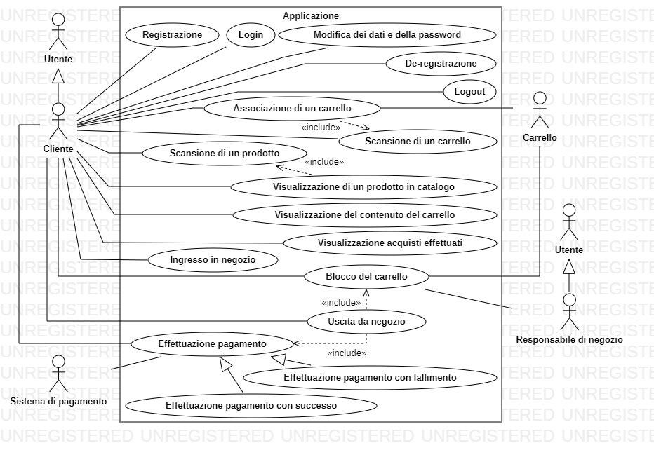
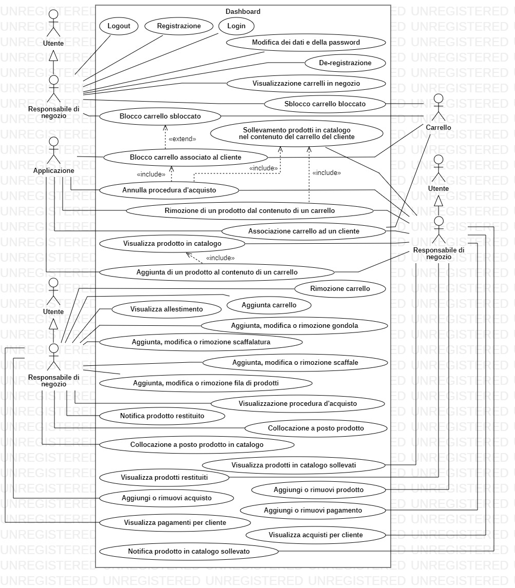
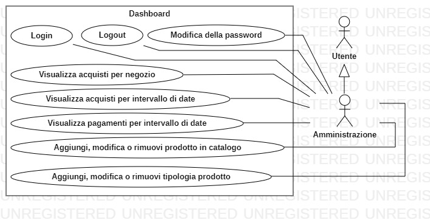
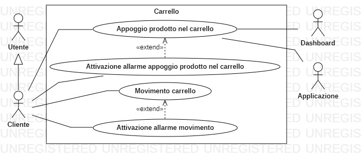
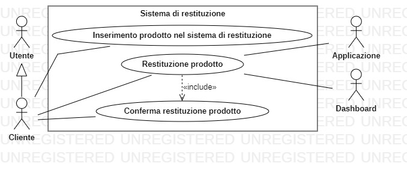
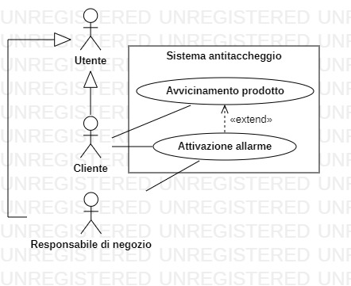
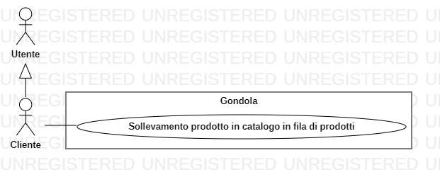

# Requisiti

## Requisiti di business

Come progetto ci si è proposti la realizzazione un sistema di gestione di un negozio smart, la scelta è ricaduta su questo sistema perchè soddisfa il nostro obiettivo principale, ovvero la realizzazione di un sistema che possa sfruttare le tecnologie inerenti ai digital twin e allo sviluppo di applicazioni che sfruttano sistemi pervasivi.

L'idea consiste nello sviluppare il sistema che i proprietari dei negozi utilizzeranno per gestire il proprio negozio, questo permetterà al negozio di poter fornire servizi ai clienti in maniera smart, ovvero senza casse e senza la presenza di cassieri, saranno tuttavia presenti dei responsabili per supervisionare il corretto funzionamento del sistema.

### Applicazione

I clienti utilizzeranno un'applicazione, che una volta installata sul proprio smartphone gli permetterà di accedere sia virtualmente che fisicamente all'interno del negozio. L'applicazione riconosce quando un cliente si avvicina o allontana, per capire se stia entrnado o uscendo dal negozio.

Una volta entrato in negozio, il cliente dovrà utilizzare l’applicazione per sbloccare i carrelli fisici, così da poterli portare con sé per effettuare gli acquisti. Questa operazione avviene scansionando un codice che è apposto sul carrello e che lo identifica univocamente. Una volta preso un carrello con sé, il cliente sarà libero di aggirarsi tra le gondole e potrà prendere i prodotti dagli scaffali. Qualora il cliente avesse deciso di non sbloccare un carrello, potrà aggirarsi per il negozio liberamente, ma non potrà fare acquisti. Se il cliente inserisce un prodotto in un carrello senza averlo prima sbloccato, questo farà partire un allarme sonoro.

L’applicazione può essere usata per scannerizzare i prodotti. Così facendo, accede a un database che contiene tutte le informazioni sul prodotto, come: il prezzo, il nome, la descrizione, eventuali sconti applicati e altri dettagli dello stesso, informazioni che vengono poi mostrate al cliente.

### Carrello smart e sistema di restituzione

Perché un prodotto venga messo nel carrello virtuale del cliente, quest’ultimo deve semplicemente appoggiare il prodotto all’interno del carrello fisico. Sarà questo a riconoscere quale prodotto è stato aggiunto e a comunicarlo con il sistema del negozio, così che possa essere comunicato a sua volta all’applicazione del cliente. Se il cliente dovesse sollevare un prodotto dallo scaffale, ma si dimenticasse di inserirlo nel carrello, sulla dashboard dello store manager comparirà un allarme che lo esorta a verificare il corretto comportamento del cliente.

Nel caso in cui il cliente non abbia più intenzione di avere un prodotto nel carrello, può sempre rimuoverlo inserendolo all’interno di un sistema costituito, tra gli altri componenti, di una pedana. Appoggiando il prodotto su di essa, il sistema farà in modo di impedire al cliente di riprenderlo e, una volta assicuratosi di ciò, procederà all’identificazione del prodotto. Dopodiché, mostrerà su uno schermo i dettagli del prodotto e un messaggio per il cliente che gli chiederà se vuole veramente eliminarlo dal carrello. Se il cliente confermerà, si aprirà l’accesso ad uno scivolo che porterà il prodotto in un luogo dove il personale del negozio potrà recuperarlo e rimetterlo a posto. Quest’azione notificherà la dashboard dello store manager che un prodotto è ora “fuori posto”, ovvero è stato restituito e va ricollocato sul suo scaffale. Se la procedura non dovesse andare a buon fine, anche per volontà del cliente, il sistema restituirà il prodotto.

### Dashboard

La dashboard è l’interfaccia che fornisce vari strumenti agli impiegati della catena di negozi; tali strumenti differiscono a seconda dell’account con cui si è effettuato il login alla dashboard.

Il responsabile di negozio ha a disposizione un’interfaccia che gli permette di visualizzare lo stato corrente del negozio a cui è assegnato e, soprattutto, interagire con esso. Potrà perciò visualizzare in tempo reale e modificare lo stato degli scaffali, dei prodotti, dei carrelli e dei processi di acquisto in atto all’interno del proprio negozio.

### Sensori

Dovranno essere collocati i seguenti sensori per permettere il corretto funzionamento del sistema:

- sensori di posizione in tutto il negozio che comunicheranno con l’applicazione la distanza tra questa e i sensori stessi per riconoscere l’ingresso e l’uscita del cliente dal negozio;
- sensori sugli scaffali per riconoscere il sollevamento degli oggetti dagli stessi;
- sensori nei carrelli fisici per riconoscere l’aggiunta dei prodotti al loro interno;
- sensori nel sistema di restituzione per permettere la rimozione dei prodotti dal carrello;
- sensori in ogni prodotto che permettano la loro identificazione univoca all’interno del negozio;
- sensori appartenenti ad un sistema antitaccheggio che rileva la presenza di prodotti che non fanno parte di nessun carrello quando vengono portati vicino all’uscita, facendo partire un allarme sonoro e un allarme visivo sulla dashboard.

## Requisiti funzionali

- L’applicatione consente ai clienti di creare un account, effettuare il login e logout, cancellare l’account.
- L’applicazione rileva l’entrata e l’uscita del cliente dal negozio.
- L’applicazione consente di sbloccare un carrello alla volta.
- L’applicazione consente al cliente di scannerizzare i prodotti e visualizzarne le informazioni.
- L’applicazione mostra al cliente i prodotti presenti nel carrello durante l’acquisto.
- L’applicazione consente al cliente di visualizzare lo storico degli acquisti.
- All’uscita dal negozio la procedura di acquisto termina e lancia il processo di pagamento.

- Il carrello rileva l’inserimento di un prodotto al suo interno.
- Il carrello attiva un allarme sonoro qualora un cliente inserisca un prodotto senza aver precedentemente sbloccato il carrello.

- Il sistema di restituzione consente ai clienti di depositare un prodotto alla volta che si desidera restituire.
- Il sistema di restituzione chiede conferma al cliente prima di processare una restituzione.
- Il sistema di restituzione notifica il sistema di negozio della restituzione, così che il prodotto restituito venga rimosso dal processo di acquisto in corso.
- Il sistema di restituzione notifica il sistema di negozio della restituzione, così che il responsabile di negozio possa individuare il prodotto da rimettere sugli scaffali.

- Il sistema antitaccheggio posto all’uscita di negozio rileva l’uscita di un carrello o di un prodotto non associato con un processo di acquisto, attivando quindi un allarme sonoro e notificando il responsabile di negozio.

- Il sistema gestisce 3 tipi di utente: cliente, responsabile di negozio, amministratore:
    - un account cliente consiste di nome, cognome, email e password
    - un account responsabile di negozio consiste di nome utente e password
    - un account amministratore consiste di nome utente e password
- tramite la dashboard un responsabile di negozio può visualizzare in tempo reale:
    - i prodotti inseriti in ciascun carrello;
    - i prodotti presenti sugli scaffali; (nome, num)
    - i prodotti da rimettere a posto;
    - i prodotti sollevati dagli scaffali ma non inseriti in nessun carrello;
    - i carrelli fisici associati a ciascun cliente;
    - lo stato del processo di acquisto di ciascun cliente, ovvero se questo è ancora in corso oppure se sta terminando perché il cliente ha lasciato il negozio.
- tramite la dashboard un responsabile di negozio può gestire il negozio a cui è assegnato come segue:
    - aggiungere o rimuovere prodotti dai singoli carrelli;
    - associare o disassociare i carrelli fisici dai clienti;
    - annullare il processo d’acquisto dei singoli clienti, impedendo eventuali pagamenti impropri;
    - cancellare gli allarmi dei prodotti sollevati e non inseriti in nessun carrello e dei prodotti da rimettere a posto dopo che questi sono stati ricollocati nella giusta posizione;
    - modificare l’allestimento del negozio, permettendo di alterare le gondole presenti, la loro struttura e i prodotti che ospitano su di esse.
- tramite la dashboard un amministratore può:
    - aggiungere o rimuovere tipologie di prodotti in vendita presso tutti i negozi della catena;
    - modificare le informazioni dei prodotti in vendita;
    - creare o eliminare gli account dei responsabili di negozio.

## Requisiti non funzionali

- Il sistema deve essere sufficientemente modulare in modo tale da essere possibile riusare i suoi componenti in contesti diversi senza problemi. Non ci devono essere dipendenze tra le classi dei componenti, ma solo verso interfacce liberamente re-implementabili.
- L'applicazione non deve mai interrompersi qualora si verifichi un errore; deve invece mostrare un messaggio di errore all'utente.
- L'applicazione deve essere fluida, cioè non presentare *stuttering* o *freezing.*

## Requisiti implementativi

- L'implementazione dell'applicazione deve essere fatta nel linguaggio "Scala", con compatibilità garantita con la versione 3.1.3.
- Deve essere sfruttato lo strumento di *build automation* "Scala Build Tool" versione 1.5.5 per automatizzare la compilazione, il *testing* e il *deployment* degli artefatti rilasciati.
- Lo sviluppo deve avvenire attingendo quanto più possibile al paradigma di programmazione funzionale.
- Domain-Driven Design.
- La repository deve essere gestita attraverso il DVCS "git" e mantenuta sul servizio di hosting "GitHub".
- Deve essere sfruttata la tecnologia offerta da "GitHub" per effettuare "*Continuous Integration*", ovvero "GitHub Actions".

## Casi d'uso

