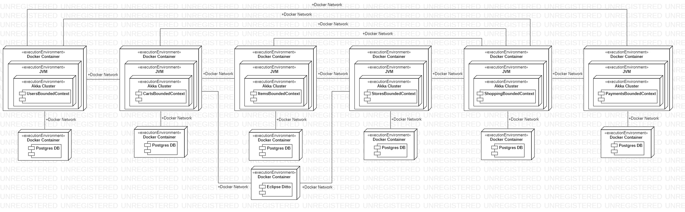

# Design

Si è seguito il processo di Domain-Driven Design volto alla costruzione di uno smart pervasive system.

Il team discutendone internamente ha creato un primo use case diagram, una volta prodotte si è passati al domain storytelling.
Durante la realizzazione di esso si è continuato a modificare gli use case, specificando azioni precedentemente non considerate e precisando le interfacce utente che sono emerse.
Una volta terminato il domain storytelling e gli use case diagram il team ha effettuato l’event storming allo scopo di esplorare propriamente la timeline di eventi e fare emergere i bounded context.

I bounded context che sono emersi sono i seguenti:
- **shopping context** - core subdomain: individuato dall’inserimento di un prodotto nel carrello, avviando così il processo di acquisto, fino alla terminazione dello stesso, determinata dall’uscita del cliente dal negozio. Shopping context è un core domain in quanto è responsabile per l’acquisto automatico dei prodotti, ovvero l’innovazione del processo di acquisto.
- **stores context** - similmente, questo context è un core domain poichè contiene gli strumenti necessari a effettuare acquisti smart.
- **carts context** - supporting subdomain: i carrelli smart si distinguono dai normali carrelli in quanto dotati di sensori e capaci di effettuare operazioni in autonomia, essendo comunque piuttosto semplici non sono però un core subdomain.
- **products context** - supporting subdomain: ogni prodotto ha un sensore.
- **users context** - supporting subdomain: normale gestione di account utente.
- **payment context** - generic subdomain: il sistema di pagamento è delegato ad un third-party service.

### Diagrammi dei casi d'uso

## Design architetturale
A seguito di un incontro è emerso che la scelta migliore sia quella di utilizzare u'architettura a microservizi, nello specifico, uno per ogni bounded context, quindi un sistema composto da un totale di 6 microservizi. L'architettura del sistema è stata poi sviluppata sulle linee guida della clean architecture di Martin Fowler. I microservizi sono:
- Users
- Carts
- Items
- Stores
- Shopping
- Payments

L'architettura del singolo microservizio è uguale per tutti ed è composta su due livelli:
- **core**: in questo livello contiene tutte le entità del dominio del microservizio e per progettazione è ad alto livello di astrazione. Questo package contiene moduli di alto livello che descrivono il dominio tramite aggregate, entities, value objects, services e domain events.
- **application**: questo livello fornisce i casi d'uso del microservizio, contiene quindi tutta la logica dell'applicazione, ha una dipendenza dal livello core. Questo livello fornisce un'interfaccia da implementare dall'esterno.

### Microservizio "Users"
"Users" è il microservizio adibito alla gestione dei dati relativi agli utenti. Tra i suoi compiti troviamo:
- aggiunta di nuovi utenti
- rimozione di utenti
- modifica dei dati di un utente
- supporto a login e logout degli utenti
- mantenimento della sessione di login degli utenti

Questo bounded context è responsabile dei seguenti aggregati:
- administration: è un'estensione di un generico user e rappresenta un amministratore del sistema
- customer: è un'estensione di un generico user e rappresente ogni cliente che utilizzerà l'appicazione
- storemanager è un'estensione di un generico user e rappresenta il manager del negozio

L'administration non può essere registrato come i customer e gli store manager ma deve essere messo hardcoded, lo storemanager è invece associato univocamente al proprio negozio.
Tutte e tre le estensioni di user hanno un servizio per poter criptare le password ed espongono un'interfaccia per poter essere create, eliminate ed aggiornate.

A livello applicazione troviamo i seguenti attori:
- attore administration: può gestire due tipologie di messaggi:
    - login: si verificano i dati e si da una risposta positiva in caso di dati di accesso corretti e negativa in caso contrario
    - update: si verificano i dati e viene data una risposta
- attore customer: può gestire cinque tipologie di messaggi:
    - registrazione
    - deregistrazione
    - login
    - update dei dati
    - update della password
- attore store manager: gestisce gli stessi tipi di messaggi di un attore di tipo customer, con la differenza di alcuni campi all'interno dei messaggi
- attore per il message broker:

Il microservizio espone le sue funzionalità all'esterno grazie alle route, ogni aggregato offre le sue operazioni specificando prima verso il tipo (eg. store_manager oppure administration) e poi il nome dell'operazione che si vuole effettuare.

### Microservizio "Items"

### Microservizio "Carts"

### Microservizio "Stores"

### Microservizio "Shopping"

### Microservizio "Payments"

## Design nel dettaglio

