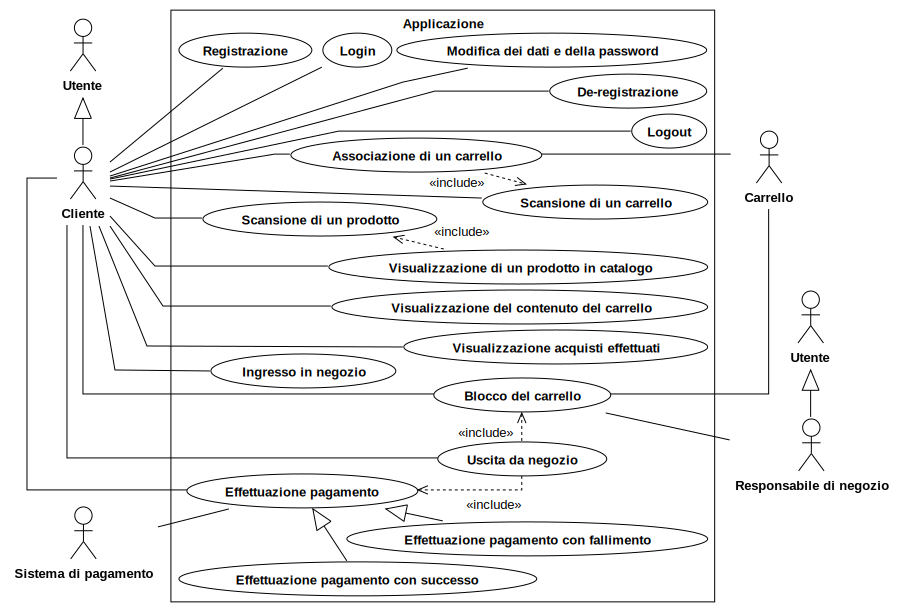
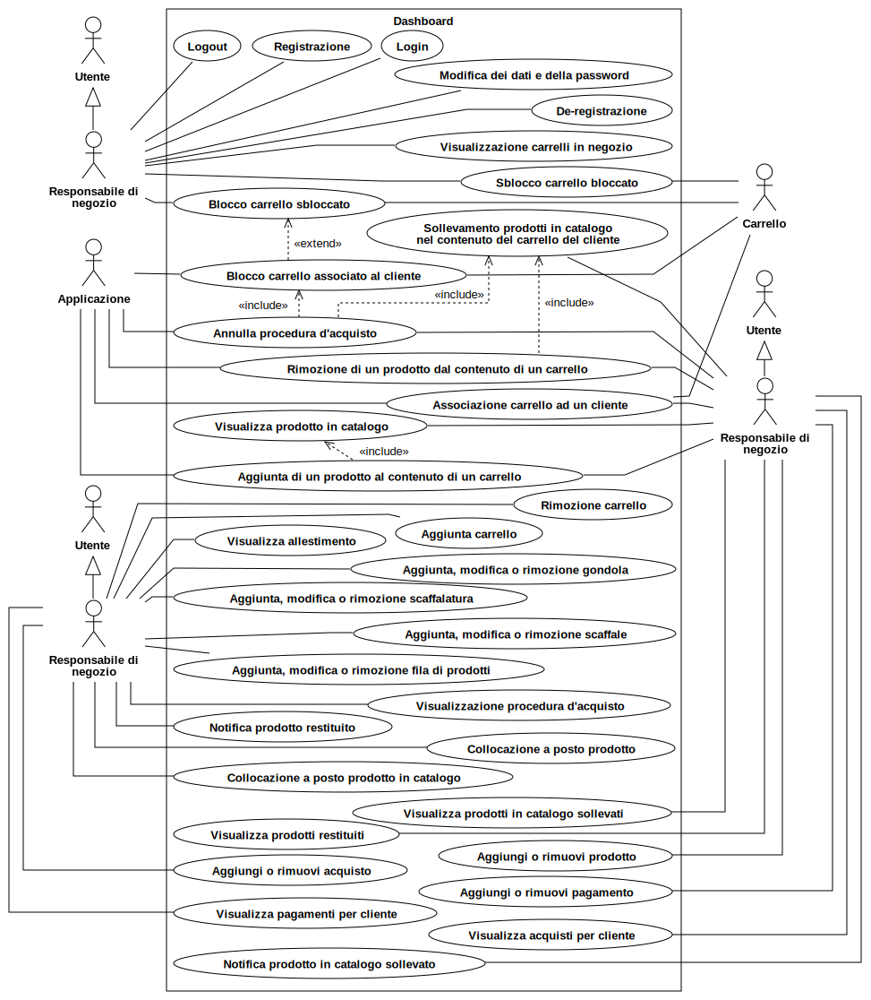
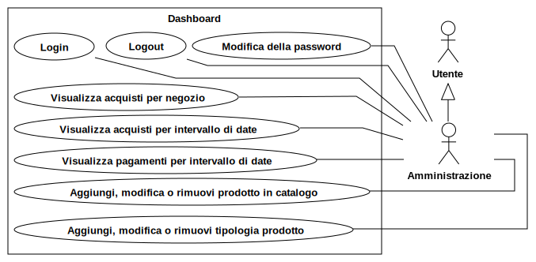
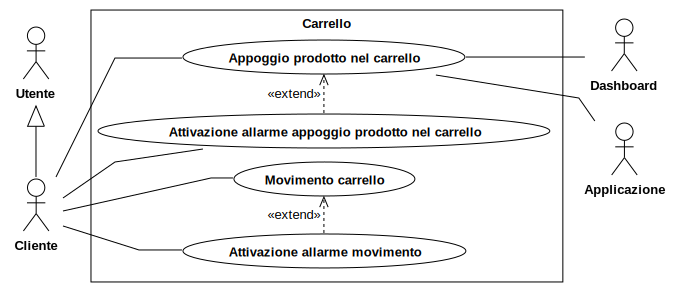
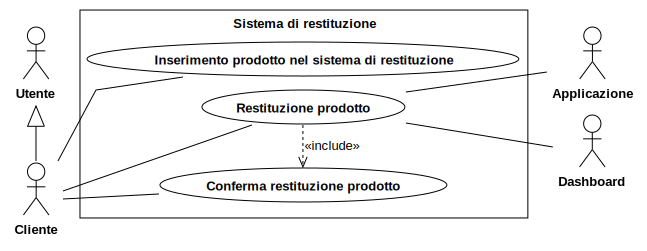
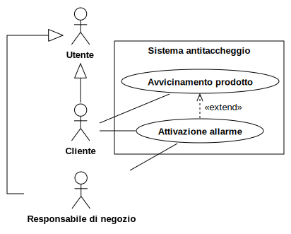
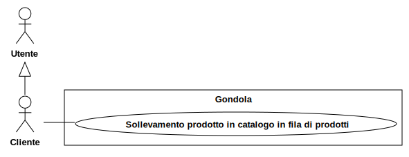

# Design

## Design architetturale

Si è seguito il processo di Domain-Driven Design volto alla costruzione di uno smart pervasive system.

Il team discutendone internamente ha creato un primo use case diagram, una volta prodotte si è passati al domain storytelling.
Durante la realizzazione di esso si è continuato a modificare gli use case, specificando azioni precedentemente non considerate e precisando le interfacce utente che sono emerse.
Una volta terminato il domain storytelling e gli use case diagram il team ha effettuato l’event storming allo scopo di esplorare propriamente la timeline di eventi e fare emergere i bounded context.

I bounded context che sono emersi sono i seguenti:
- **shopping context** - core subdomain: individuato dall’inserimento di un prodotto nel carrello, avviando così il processo di acquisto, fino alla terminazione dello stesso, determinata dall’uscita del cliente dal negozio. Shopping context è un core domain in quanto è responsabile per l’acquisto automatico dei prodotti, ovvero l’innovazione del processo di acquisto.
- **stores context** - similmente, questo context è un core domain poichè contiene gli strumenti necessari a effettuare acquisti smart.
- **carts context** - supporting subdomain: i carrelli smart si distinguono dai normali carrelli in quanto dotati di sensori e capaci di effettuare operazioni in autonomia, essendo comunque piuttosto semplici non sono però un core subdomain.
- **products context** - supporting subdomain: ogni prodotto ha un sensore.
- **users context** - supporting subdomain: normale gestione di account utente.
- **payment context** - generic subdomain: il sistema di pagamento è delegato ad un third-party service.

### Diagrammi dei casi d'uso

A seguito di un incontro è emerso che la scelta migliore sia quella di utilizzare u'architettura a microservizi, nello specifico, uno per ogni bounded context, quindi un sistema composto da un totale di 6 microservizi. L'architettura del sistema è stata poi sviluppata sulle linee guida della clean architecture di Martin Fowler. I microservizi sono:
- Users
- Carts
- Items
- Stores
- Shopping
- Payments

L'architettura del singolo microservizio è uguale per tutti ed è composta su due livelli:
- **domain**: questo livello contiene tutte le entità del dominio del microservizio, è ad un più alto livello di astrazione, rispetto al livello successivo perchè è interessato esclusivamente al modello del dominio. Le entità del dominio sono modellate come aggregate, entities, value objects, services e domain events.
Ogni aggregate inoltre espone al livello application attraverso il proprio repository le funzionalità di persistenza dei dati.
- **application**: questo livello cattura i casi d'uso del microservizio, contiene quindi tutta la logica dell'applicazione ed è quindi dipendente dal livello domain. Questo livello fornisce un'interfaccia utilizzabile dall'esterno (attraverso l'invio e la ricezione di messaggi).
Contiene due moduli:
    - **actors**: questo modulo contiene gli attori che descrivono il comportamento a livello applicazione. Ogni attore al proprio interno gestisce una serie di richieste e fornisce per ognuna la corrispondente risposta.
    - **routes**: questo modulo contiene le route di un web service che descrivono l'API che il microservizio espone verso l'esterno.
    Ciascuna route è rappresentata da un'URI, alla quale possono essere fatte richieste di tipo GET, POST, PUT o DELETE.
    La codifica dei messaggi che vengono inviati e ricevuti contattando il web service è sempre in formato JSON.

    
## Design nel dettaglio

### Microservizio "Users"
"Users" è il microservizio adibito alla gestione dei dati relativi agli utenti.

Come ogni microservizio ha una serie di messaggi in ingresso e restituisce in uscita:
- comunicazioni in ingresso: 
    - registrazione e de-registrazione di nuovi utenti (inviato da applicazione)
    - modifica dei dati e della password di un utente (inviato da applicazione)
    - login (inviato da applicazione e dashboard)
    - registrazione e de-registrazione di nuovi store manager (inviato da dashboard)
    - modifica dei dati e della password di uno store manager (inviato da dashboard)
    - modifica della password di un administration (inviato da dashboard)
- comunicazioni in uscita:
    - notifica del cliente de-registrato (inviato ai microservizi shopping, carts e payments)

Le operazioni di login sono delle query che leggono informazioni contenute nel microservizio, le altre operazioni vanno ad apportare modifiche ai dati gestiti all'interno del microservizio modificandone lo stato.

### Livello domain
Questo bounded context è responsabile dei seguenti aggregates:
- user: rappresenta un generico utente del sistema
- administration: è un utente che svolge il ruolo di amministratore del sistema
- customer: è un utente che rappresenta cliente che utilizzerà l'appicazione
- store manager è un utente che rappresenta il responsabile di negozio

Nel sistema esiste un unico profilo di administration, questo significa che non è possibile ne registrarne di nuovi o de-registrare quello esistente, questo profilo viene inserito all'avvio del sistema.
User mette a disposizione un servizio per poter cifrare le password ed espone un'interfaccia per poter essere creato, eliminato ed aggiornato.

### Livello application
Per definire il comportamento di questo bounded context sono stati utilizzati i seguenti attori:
- administration server actor: può gestire due tipologie di messaggi:
    - login: i confrontano i dati forniti con quelli presenti nel sistema, in caso di corretta associazione viene fornita una rispota positiva, negativa altrimenti
    - update: permette l'aggiornamento della password e viene data una positiva in caso l'operazione abbia avuto successo, negativa altrimenti
- customer server actor: gestisce gli stessi messaggi di administration con l'aggiunta di:
    - update: permette l'aggiornamento dei dati e della password e viene data una positiva in caso l'operazione abbia avuto successo, negativa altrimenti
    - registrazione: permette l'inserimento di un nuovo customer specificado lo username ed una password, viene data una risposta positiva in caso l'operazione abbia avuto successo, negativa altrimenti
    - deregistrazione: permette l'eliminazione di un customer specificado lo username ed una password, viene data una risposta positiva in caso l'operazione abbia avuto successo, negativa altrimenti
- store manager server actor: gestisce gli stessi tipi di messaggi di un attore di tipo customer, con la differenza di alcuni campi diversi nel login e nell'update.
- attore per il message broker: in questo bounded context abbiamo necessità di questo attore per poter generare eventi in uscita, i quali informano i bounded context shopping, carts e payments che un utente si è de-registrato, di qualsiasi tipologia.

### Microservizio "Items"
"Items" è il microservizio adibito alla gestione dei dati relativi ai prodotti.

Come ogni microservizio ha una serie di messaggi in ingresso e in uscita:
- comunicazioni in ingresso:
    - comandi che modificano lo stato:
        - aggiungere, rimuovere e aggiornare categorie di prodotto (inviato da dashboard)
        - aggiungere, rimuovere e aggiornare prodotti in catalogo (inviato da dashboard)
        - aggiungere e rimuovere prodotti (inviato da dashboard)
    - query di visualizzazione:
        - visualizzare prodotti in catalogo (inviato da dashboard, applicazione e microservizio shopping)
        - visualizzare prodotti restituiti (inviato da dashboard)
        - visualizzare prodotti in catalogo sollevati (inviato da dashboard)
        - visualizzare tipologia di prodotto (inviato da dashboard e microservizio store)
    - eventi:
        - prodotto rimesso a posto (inviato da dashboard)
        - prodotto in catalogo rimesso a posto (inviato da dashboard)
        - prodotto in catalogo sollevato (inviato dai microservizi shopping e store)
        - prodotto aggiunto al carrello (inviato dai microservizi shopping e cart)
        - prodotto restituito (inviato dal microservizio store)
- comunicazioni in uscita:
    - query di visualizzazione:
        - visualizzare presenza processi d'acqusito con prodotto (inviato a microservizio shopping)

### Livello domain
Il bounded context associato a questo microservizio è responsabile dei seguenti aggregates:
- item category: rappresenta una categoria di prodotto, ovvero un tipologia di prodotti che possiedono stesso nome e descrizione
- catalog item: rappresenta un prodotto contenuto nel catalogo di un negozio. Possono essere di due tipi:
    - in place: rappresenta un prodotto in catalogo che è al momento al proprio posto su una fila di uno scaffale
    - lifted: rappresenta un prodotto in catalogo che è al momento sollevato dalla propria fila
- item: rappresenta il singolo prodotto, può essere di tre tipi:
    - in place: rappresenta il prodotto mentre si trova in una fila di prodotti
    - in cart: rappresenta un prodotto in un carrello
    - returned: rappresenta un prodotto che è stato restituito

### Livello application
Per definire il comportamento di questo microservizio troviamo i seguenti attori:
- item category server actor: gestisce le operazioni relative alle categorie di prodotti, al suo interno vengono gestiti i seguenti messaggi:
    - show: dato l'identificatore di una categoria di prodotto, restituisce una risposta con le informazioni relative ad esso nel caso esista, altrimenti dà una risposta negativa
    - add: permette l'inserimento di una categoria di prodotti specificando il nome e la descrizione, viene data una risposta positiva se l'operazione è andata a buon fine, negativa altrimenti
    - remove: permette l'eliminazione di una categoria di prodotti specificando l'identificativo, viene data una risposta positiva se l'operazione è andata a buon fine, negativa altrimenti
    - update: permette l'aggiornamento del nome e della descrizione, viene data una positiva in caso l'operazione abbia avuto successo, negativa altrimenti
- catalog item server actor: gestisce le operazioni relative ai prodotti in catalogo, al suo interno vengono gestiti i seguenti messaggi:
    - show all lifted: permette di visualizzare tutti i prodotti in catalogo che al momento sono sollevati
    - add: permette l'inserimento di un prodotto in catalogo specificando la categoria di prodotto, il negozio di appartenenza ed il prezzo, viene data una risposta positiva se l'operazione è andata a buon fine, negativa altrimenti
    - remove: permette l'eliminazione di un prodotto in catalogo specificando l'identificativo, ovvero un numero incrementale e il codice negozio, e viene data una risposta positiva se l'operazione è andata a buon fine, negativa altrimenti
    - update: permette l'aggiornamento del prezzo, viene data una positiva in caso l'operazione abbia avuto successo, negativa altrimenti
- item server actor: gestisce le operazioni relative alle categorie di prodotti, al suo interno vengono gestiti i seguenti messaggi:
    - show all returned: permette di visualizzare tutti i prodotti che sono stati restituiti
    - add: permette l'inserimento di un prodotto specificando l'identificativo (composto da un proprio id, dall'id dello store e dal prodotto in catalogo) e viene data una risposta positiva se l'operazione è andata a buon fine, negativa altrimenti
    - remove: permette l'eliminazione di un prodotto specificando l'identificativo e viene data una risposta positiva se l'operazione è andata a buon fine, negativa altrimenti
    - update: permette l'aggiornamento dello stato del prodotto, viene data una positiva in caso l'operazione abbia avuto successo, negativa altrimenti
- attore per il message broker: in questo bounded context abbiamo necessità di questo attore per poter catturare eventi in ingresso:
    - prodotto rimesso a posto: quando un prodotto viene riposto sullo scaffale
    - prodotto in catalogo rimesso a posto: quando un prodotto in catalogo viene riposto sullo scaffale
    - sollevamento prodotto in catalogo: quando un prodotto in catalogo viene sollevato dal proprio scaffale
    - aggiunta prodotto in carrello: quando in un carrello viene posato un prodotto
    - restituzione prodotto: quando un prodotto viene restituito attraverso l'apposito sistema

### Microservizio "Carts"

"Carts" è il microservizio adibito alla gestione dei dati relativi ai carrelli.

Come ogni microservizio ha una serie di messaggi in ingresso in uscita:
- messaggi in ingresso:
    - query che modificano lo stato:
        - associare un carrello ad un utente (inviato da applicazione e dashboard)
        - sbloccare un carrello bloccato (inviato da dashboard)
        - bloccare un carrello sbloccato (inviato da dashboard)
        - aggiungi un carrello (inviato da dashboard)
        - rimuovi un carrello (inviato da dashboard)
        - blocca un carrello associato ad un cliente (inviato da shopping)
    - query di visualizzazione:
        - visualizza i carrelli in negozio (inviato da dashboard)
    - eventi
        - notifica di appoggio di un prodotto nel carrello (inviato da user)
        - notifica del movimento del carrello (inviato da cliente)
        - notifica cliente de-registrato (inviato da users)
- messaggi in uscita
    - eventi
        - Notifica aggiunta prodotto in carrello (inviato a prodotti)
        - Notifica di aggiunta di un prodotto in carrello (inviato a shopping)
        - Notifica associazione carrello (inviato a shopping)
    - query che modificano lo stato
        - Attiva allarme carrello (inviato a users)

### Livello domain

Il bounded context associato a questo microservizio è responsabile dei seguenti aggregates:
- cart: rappresentano i carrelli del sistema, possono essere di tre tipologie:
    - associated cart: rappresenta un carrello che è associato ad un cliente
    - locked cart: rappresenta un carrello che è bloccato
    - unlocked cart: rappresenta un cartello che è sbloccato

Cart mette a disposizione un'interfaccia per poter essere creato, eliminato ed aggiornato

### Livello application
Per definire il comportamento di questo bounded context sono stati utilizzati i seguenti attori:
- cart server actor: gestisce le operazioni relative ai carrelli, al suo interno vengono gestiti i seguenti messaggi:
    - associate cart to customer: permette di associare un carrello ad un cliente, viene data una risposta positiva se l'operazione è andata a buon fine, negativa altrimenti
    - unlock locked cart: sblocca un carrello precedentemente bloccato, viene data una risposta positiva se l'operazione è andata a buon fine, negativa altrimenti
    - lock unocked cart: blocca un carrello sbloccato, viene data una risposta positiva se l'operazione è andata a buon fine, negativa altrimenti
    - add: aggiunge un nuovo carrello, viene data una risposta positiva se l'operazione è andata a buon fine, negativa altrimenti
    - remove: rimuove un carrello pre esistente, viene data una risposta positiva se l'operazione è andata a buon fine, negativa altrimenti
    - show carts: visualizza tutti i carrelli in un dato negozio, viene data una risposta positiva se l'operazione è andata a buon fine, negativa altrimenti
- attore per il message broker: in questo bounded context abbiamo necessità di questo attore per poter generare eventi in uscita:
    - notifica aggiunta prodotto in carrello: evento che si inoltra a prodotti e shopping in quanto devono aggiornarsi
    - notifica associazione carrello: evento che si inoltra a shopping per informarlo che il carrello è associato ad un cliente
    - attiva allarme carrello: evento che si inoltra a cliente per informarlo attraverso l'allarme
- attore per ditto: questo attore comunica con l'istanza di ditto per poter effettuare operazioni di aggiunta, modifica e rimozione di elementi.

### Microservizio "Stores"
"Stores" è il microservizio adibito alla gestione delle informazioni relative ai negozi: allestimento, sistema antitaccheggio e sistema di restituzione.

Come ogni microservizio ha una serie di messaggi in ingresso e restituisce in uscita:
- comunicazioni in ingresso:
    - query per aggiornamenti:
        - aggiungi / modifica / elimina fila di prodotti (inviato da dashboard)
        - aggiungi / modifica / elimina scaffalatura (inviato da dashboard)
        - aggiungi / modifica / elimina scaffale (inviato da dashboard)
        - aggiungi / modifica / elimina gondola(inviato da dashboard)
    - query per visualizzare dati:
        - visualizza allestimento (inviato da dashboard)
        - visualizza presenza allestimenti con prodotto (inviato da prodotti)
    - eventi:
        - notifica prodotto inserito in sistema di restituizione (inviato da cliente)
        - notifica prodotto restituito (inviato da cliente)
        - notifica rilevamento prodotto dal sistema antitaccheggio (inviato da cliente)
        - notifica sollevamento prodotto in catalogo (inviato da cliente)
- comunicazioni in uscita:
    - query per visualizzare dati:
        - visualizza prodotto (inviato a cliente)
    - eventi
        - notifica di allarme del sistema antitaccheggio (inviato a cliente)
        - notifica restituzione prodotto (inviato a prodotti)
        - notifica sollevamento prodotto in catalogo (inviato a prodotti)
        - notifica prodotto restituito (inviato a shopping)
        - notifica prodotto in catalogo sollevato (inviato a dashboard)
        - notifica prodotto restituito (inviato a dashboard)

### Microservizio "Shopping"
"Shopping" è il microservizio adibito alla gestione delle informazioni relative agli acquisti presso un negozio.

Come ogni microservizio ha una serie di messaggi in ingresso e restituisce in uscita:
- comunicazioni in ingresso:
    - query per aggiornamenti:
        - annulla procedura d'acquisto cliente (inviato da dashboard)
        - aggiunta / rimozione di un prodotto dal contenuto del carrello di un cliente (inviato da dashboard)
    - query per visualizzare dati:
        - visualizza procedura d'acquisto cliente (inviato da dashboard e applicazione)
        - visualizza presenza processi d'acqusito con prodotto (inviato da prodotti)
    - eventi:
        - notifica inizio procedura di acquisto di un cliente (inviato da applicazione)
        - notifica termine procedura di acquisto di un cliente (inviato da applicazione)
        - notifica associazione carrello (inviato da carrelli)
        - notifica di aggiunta di un prodotto al carrello (inviato da applicazione)
        - notifica prodotto restituito (inviato da negozi)
        - notifica cliente de-registrato (inviato da utenti)
- comunicazioni in uscita:
    - query per aggiornamenti:
        - blocca un carrello (inviato a carrelli)
        - aggiungi acquisto (inviato a pagamenti)
        - aggiungi acquisto (inviato a pagamenti)
        - rimuovi prodotto (inviato a prodotti)
    - eventi:
        - notifica sollevamento prodotto in catalogo (inviato a prodotti)
        - notifica aggiunta prodotto in carrello (inviato a prodotti)

### Microservizio "Payments"
"Payments" è il microservizio adibito alla gestione delle informazioni relative ai pagamenti effettuati a seguito degli acquisti effettuati.

Come ogni microservizio ha una serie di messaggi in ingresso e restituisce in uscita:
- comunicazioni in ingresso:
    - query per aggiornamenti:
        - registra carta di pagamento cliente (inviato da applicazione)
        - modifica carta di pagamento cliente (inviato da applicazione)
        - aggiungi acquisto (inviato da dashboard e shopping)
        - rimuovi acquisto (inviato da dashboard)
        - aggiungi pagamento (inviato da dashboard e shopping)
        - rimuovi pagamento (inviato da dashboard)
    - query per visualizzare dati:
        - visualizza acquisti per cliente (inviato da applicazione e dashboard)
        - visualizza acquisti per intervallo di date (inviato da dashboard)
        - visualizza acquisti per negozio (inviato da dashboard)
        - visualizza pagamenti per intervallo di date (inviato da dashboard)
        - visualizza pagamenti per cliente (inviato da dashboard)
    - eventi:
        - notifica pagamento con successo (inviato da pagamenti)
        - notifica pagamento con fallimento (inviato da pagamenti)
        - notifica de-registrazione cliente (inviato da utenti)
- comunicazioni in uscita:
    - eventi:
        - notifica pagamento effettuato con successo (inviato ad applicazione)
        - notifica pagamento effettuato con fallimento (inviato ad applicazione)
