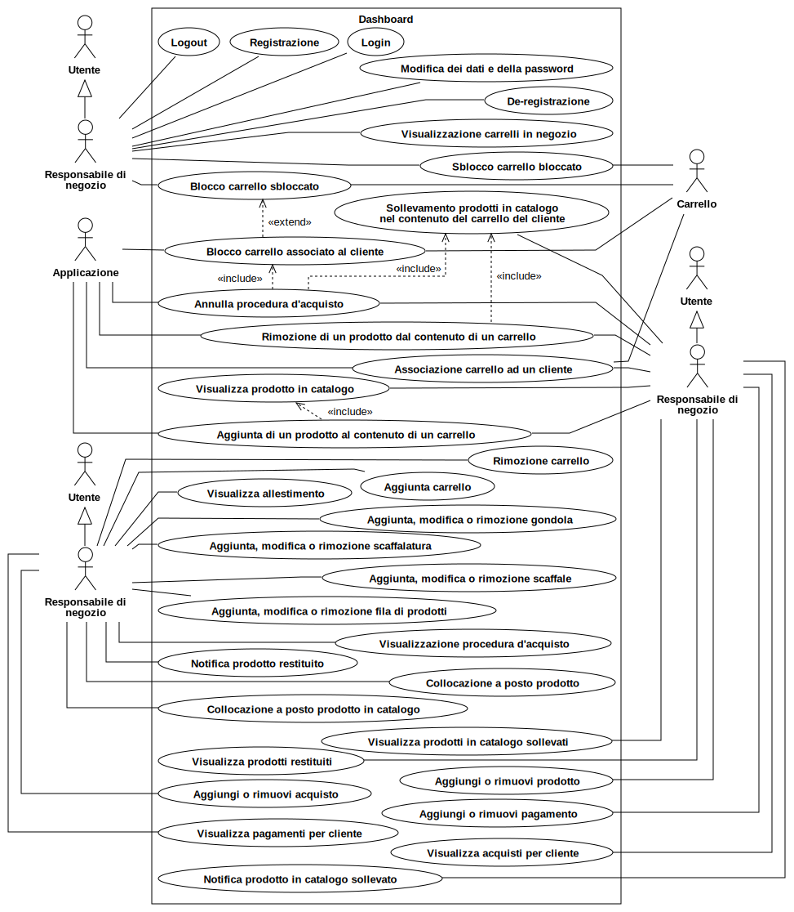
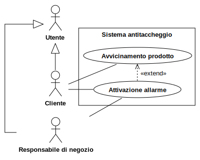
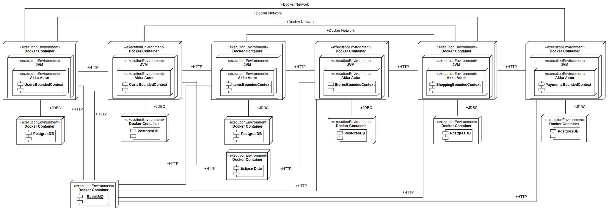

# Introduzione

"Toys Store" è un progetto con il quale si vuole realizzare un negozio di giocattoli smart, ovvero senza casse: i clienti potranno effettuare acquisti semplicemente uscendo dal negozio.
Il negozio verrà realizzato dotando ogni prodotto, carrello, scaffale etc di sensori, risultando così in un sistema di pervasive computing. 
In negozio saranno comunque presenti responsabili di negozio per allestire i prodotti e aiutare i clienti in caso di bisogno.

# Requisiti

## Requisiti di business

Come progetto ci si è proposti la realizzazione un sistema di gestione di un negozio smart, la scelta è ricaduta su questo sistema perchè soddisfa il nostro obiettivo principale, ovvero la realizzazione di un sistema che possa sfruttare le tecnologie inerenti ai digital twin e allo sviluppo di applicazioni che sfruttano sistemi pervasivi.

L'idea consiste nello sviluppare il sistema che i proprietari dei negozi utilizzeranno per gestire il proprio negozio, questo permetterà al negozio di poter fornire servizi ai clienti in maniera smart, ovvero senza casse e senza la presenza di cassieri, saranno tuttavia presenti dei responsabili per supervisionare il corretto funzionamento del sistema.

### Applicazione

I clienti utilizzeranno un'applicazione, che una volta installata sul proprio smartphone gli permetterà di accedere sia virtualmente che fisicamente all'interno del negozio. L'applicazione riconosce quando un cliente si avvicina o allontana, per capire se stia entrnado o uscendo dal negozio.

Una volta entrato in negozio, il cliente dovrà utilizzare l’applicazione per sbloccare i carrelli fisici, così da poterli portare con sé per effettuare gli acquisti. Questa operazione avviene scansionando un codice che è apposto sul carrello e che lo identifica univocamente. Una volta preso un carrello con sé, il cliente sarà libero di aggirarsi tra le gondole e potrà prendere i prodotti dagli scaffali. Qualora il cliente avesse deciso di non sbloccare un carrello, potrà aggirarsi per il negozio liberamente, ma non potrà fare acquisti. Se il cliente inserisce un prodotto in un carrello senza averlo prima sbloccato, questo farà partire un allarme sonoro.

L’applicazione può essere usata per scannerizzare i prodotti. Così facendo, accede a un database che contiene tutte le informazioni sul prodotto, come: il prezzo, il nome, la descrizione, eventuali sconti applicati e altri dettagli dello stesso, informazioni che vengono poi mostrate al cliente.

### Carrello smart e sistema di restituzione

Perché un prodotto venga messo nel carrello virtuale del cliente, quest’ultimo deve semplicemente appoggiare il prodotto all’interno del carrello fisico. Sarà questo a riconoscere quale prodotto è stato aggiunto e a comunicarlo con il sistema del negozio, così che possa essere comunicato a sua volta all’applicazione del cliente. Se il cliente dovesse sollevare un prodotto dallo scaffale, ma si dimenticasse di inserirlo nel carrello, sulla dashboard dello store manager comparirà un allarme che lo esorta a verificare il corretto comportamento del cliente.

Nel caso in cui il cliente non abbia più intenzione di avere un prodotto nel carrello, può sempre rimuoverlo inserendolo all’interno di un sistema costituito, tra gli altri componenti, di una pedana. Appoggiando il prodotto su di essa, il sistema farà in modo di impedire al cliente di riprenderlo e, una volta assicuratosi di ciò, procederà all’identificazione del prodotto. Dopodiché, mostrerà su uno schermo i dettagli del prodotto e un messaggio per il cliente che gli chiederà se vuole veramente eliminarlo dal carrello. Se il cliente confermerà, si aprirà l’accesso ad uno scivolo che porterà il prodotto in un luogo dove il personale del negozio potrà recuperarlo e rimetterlo a posto. Quest’azione notificherà la dashboard dello store manager che un prodotto è ora “fuori posto”, ovvero è stato restituito e va ricollocato sul suo scaffale. Se la procedura non dovesse andare a buon fine, anche per volontà del cliente, il sistema restituirà il prodotto.

### Dashboard

La dashboard è l’interfaccia che fornisce vari strumenti agli impiegati della catena di negozi; tali strumenti differiscono a seconda dell’account con cui si è effettuato il login alla dashboard.

Il responsabile di negozio ha a disposizione un’interfaccia che gli permette di visualizzare lo stato corrente del negozio a cui è assegnato e, soprattutto, interagire con esso. Potrà perciò visualizzare in tempo reale e modificare lo stato degli scaffali, dei prodotti, dei carrelli e dei processi di acquisto in atto all’interno del proprio negozio.

### Sensori

Dovranno essere collocati i seguenti sensori per permettere il corretto funzionamento del sistema:

- sensori di posizione in tutto il negozio che comunicheranno con l’applicazione la distanza tra questa e i sensori stessi per riconoscere l’ingresso e l’uscita del cliente dal negozio;
- sensori sugli scaffali per riconoscere il sollevamento degli oggetti dagli stessi;
- sensori nei carrelli fisici per riconoscere l’aggiunta dei prodotti al loro interno;
- sensori nel sistema di restituzione per permettere la rimozione dei prodotti dal carrello;
- sensori in ogni prodotto che permettano la loro identificazione univoca all’interno del negozio;
- sensori appartenenti ad un sistema antitaccheggio che rileva la presenza di prodotti che non fanno parte di nessun carrello quando vengono portati vicino all’uscita, facendo partire un allarme sonoro e un allarme visivo sulla dashboard.

## Requisiti funzionali

- L’applicatione consente ai clienti di creare un account, effettuare il login e logout, cancellare l’account.
- L’applicazione rileva l’entrata e l’uscita del cliente dal negozio.
- L’applicazione consente di sbloccare un carrello alla volta.
- L’applicazione consente al cliente di scannerizzare i prodotti e visualizzarne le informazioni.
- L’applicazione mostra al cliente i prodotti presenti nel carrello durante l’acquisto.
- L’applicazione consente al cliente di visualizzare lo storico degli acquisti.
- All’uscita dal negozio la procedura di acquisto termina e lancia il processo di pagamento.

- Il carrello rileva l’inserimento di un prodotto al suo interno.
- Il carrello attiva un allarme sonoro qualora un cliente inserisca un prodotto senza aver precedentemente sbloccato il carrello.

- Il sistema di restituzione consente ai clienti di depositare un prodotto alla volta che si desidera restituire.
- Il sistema di restituzione chiede conferma al cliente prima di processare una restituzione.
- Il sistema di restituzione notifica il sistema di negozio della restituzione, così che il prodotto restituito venga rimosso dal processo di acquisto in corso.
- Il sistema di restituzione notifica il sistema di negozio della restituzione, così che il responsabile di negozio possa individuare il prodotto da rimettere sugli scaffali.

- Il sistema antitaccheggio posto all’uscita di negozio rileva l’uscita di un carrello o di un prodotto non associato con un processo di acquisto, attivando quindi un allarme sonoro e notificando il responsabile di negozio.

- Il sistema gestisce 3 tipi di utente: cliente, responsabile di negozio, amministratore:
    - un account cliente consiste di nome, cognome, email e password
    - un account responsabile di negozio consiste di nome utente e password
    - un account amministratore consiste di nome utente e password
- tramite la dashboard un responsabile di negozio può visualizzare in tempo reale:
    - i prodotti inseriti in ciascun carrello;
    - i prodotti presenti sugli scaffali; (nome, num)
    - i prodotti da rimettere a posto;
    - i prodotti sollevati dagli scaffali ma non inseriti in nessun carrello;
    - i carrelli fisici associati a ciascun cliente;
    - lo stato del processo di acquisto di ciascun cliente, ovvero se questo è ancora in corso oppure se sta terminando perché il cliente ha lasciato il negozio.
- tramite la dashboard un responsabile di negozio può gestire il negozio a cui è assegnato come segue:
    - aggiungere o rimuovere prodotti dai singoli carrelli;
    - associare o disassociare i carrelli fisici dai clienti;
    - annullare il processo d’acquisto dei singoli clienti, impedendo eventuali pagamenti impropri;
    - cancellare gli allarmi dei prodotti sollevati e non inseriti in nessun carrello e dei prodotti da rimettere a posto dopo che questi sono stati ricollocati nella giusta posizione;
    - modificare l’allestimento del negozio, permettendo di alterare le gondole presenti, la loro struttura e i prodotti che ospitano su di esse.
- tramite la dashboard un amministratore può:
    - aggiungere o rimuovere tipologie di prodotti in vendita presso tutti i negozi della catena;
    - modificare le informazioni dei prodotti in vendita;
    - creare o eliminare gli account dei responsabili di negozio.

## Requisiti non funzionali

- Il sistema deve essere sufficientemente modulare in modo tale da essere possibile riusare i suoi componenti in contesti diversi senza problemi. Non ci devono essere dipendenze tra le classi dei componenti, ma solo verso interfacce liberamente re-implementabili.
- L'applicazione non deve mai interrompersi qualora si verifichi un errore; deve invece mostrare un messaggio di errore all'utente.
- L'applicazione deve essere fluida, cioè non presentare *stuttering* o *freezing.*

## Requisiti implementativi

- L'implementazione dell'applicazione deve essere fatta nel linguaggio "Scala", con compatibilità garantita con la versione 3.1.3.
- Deve essere sfruttato lo strumento di *build automation* "Scala Build Tool" versione 1.5.5 per automatizzare la compilazione, il *testing* e il *deployment* degli artefatti rilasciati.
- Lo sviluppo deve avvenire attingendo quanto più possibile al paradigma di programmazione funzionale.
- Domain-Driven Design.
- La repository deve essere gestita attraverso il DVCS "git" e mantenuta sul servizio di hosting "GitHub".
- Deve essere sfruttata la tecnologia offerta da "GitHub" per effettuare "*Continuous Integration*", ovvero "GitHub Actions".

# Design

## Design architetturale

Si è seguito il processo di Domain-Driven Design volto alla costruzione di uno smart pervasive system.

Il team discutendone internamente ha creato un primo use case diagram, una volta prodotte si è passati al domain storytelling.
Durante la realizzazione di esso si è continuato a modificare gli use case, specificando azioni precedentemente non considerate e precisando le interfacce utente che sono emerse.
Una volta terminato il domain storytelling e gli use case diagram il team ha effettuato l’event storming allo scopo di esplorare propriamente la timeline di eventi e fare emergere i bounded context.

I bounded context che sono emersi sono i seguenti:
- **shopping context** - core subdomain: individuato dall’inserimento di un prodotto nel carrello, avviando così il processo di acquisto, fino alla terminazione dello stesso, determinata dall’uscita del cliente dal negozio. Shopping context è un core domain in quanto è responsabile per l’acquisto automatico dei prodotti, ovvero l’innovazione del processo di acquisto.
- **stores context** - similmente, questo context è un core domain poichè contiene gli strumenti necessari a effettuare acquisti smart.
- **carts context** - supporting subdomain: i carrelli smart si distinguono dai normali carrelli in quanto dotati di sensori e capaci di effettuare operazioni in autonomia, essendo comunque piuttosto semplici non sono però un core subdomain.
- **products context** - supporting subdomain: ogni prodotto ha un sensore.
- **users context** - supporting subdomain: normale gestione di account utente.
- **payment context** - generic subdomain: il sistema di pagamento è delegato ad un third-party service.

### Diagrammi dei casi d'uso

A seguito di un incontro è emerso che la scelta migliore sia quella di utilizzare u'architettura a microservizi, nello specifico, uno per ogni bounded context, quindi un sistema composto da un totale di 6 microservizi. L'architettura del sistema è stata poi sviluppata sulle linee guida della clean architecture di Martin Fowler. I microservizi sono:
- Users
- Carts
- Items
- Stores
- Shopping
- Payments

L'architettura del singolo microservizio è uguale per tutti ed è composta su due livelli:
- **domain**: questo livello contiene tutte le entità del dominio del microservizio, è ad un più alto livello di astrazione, rispetto al livello successivo perchè è interessato esclusivamente al modello del dominio. Le entità del dominio sono modellate come aggregate, entities, value objects, services e domain events.
Ogni aggregate inoltre espone al livello application attraverso il proprio repository le funzionalità di persistenza dei dati.
- **application**: questo livello cattura i casi d'uso del microservizio, contiene quindi tutta la logica dell'applicazione ed è quindi dipendente dal livello domain. Questo livello fornisce un'interfaccia utilizzabile dall'esterno (attraverso l'invio e la ricezione di messaggi).
Contiene due moduli:
    - **actors**: questo modulo contiene gli attori che descrivono il comportamento a livello applicazione. Ogni attore al proprio interno gestisce una serie di richieste e fornisce per ognuna la corrispondente risposta.
    - **routes**: questo modulo contiene le route di un web service che descrivono l'API che il microservizio espone verso l'esterno.
    Ciascuna route è rappresentata da un'URI, alla quale possono essere fatte richieste di tipo GET, POST, PUT o DELETE.
    La codifica dei messaggi che vengono inviati e ricevuti contattando il web service è sempre in formato JSON.

    
## Design nel dettaglio

### Microservizio "Users"
"Users" è il microservizio adibito alla gestione dei dati relativi agli utenti.

Come ogni microservizio ha una serie di messaggi in ingresso e restituisce in uscita:
- comunicazioni in ingresso: 
    - registrazione e de-registrazione di nuovi utenti (inviato da applicazione)
    - modifica dei dati e della password di un utente (inviato da applicazione)
    - login (inviato da applicazione e dashboard)
    - registrazione e de-registrazione di nuovi store manager (inviato da dashboard)
    - modifica dei dati e della password di uno store manager (inviato da dashboard)
    - modifica della password di un administration (inviato da dashboard)
- comunicazioni in uscita:
    - notifica del cliente de-registrato (inviato ai microservizi shopping, carts e payments)

Le operazioni di login sono delle query che leggono informazioni contenute nel microservizio, le altre operazioni vanno ad apportare modifiche ai dati gestiti all'interno del microservizio modificandone lo stato.

### Livello domain
Questo bounded context è responsabile dei seguenti aggregates:
- user: rappresenta un generico utente del sistema
- administration: è un utente che svolge il ruolo di amministratore del sistema
- customer: è un utente che rappresenta cliente che utilizzerà l'appicazione
- store manager è un utente che rappresenta il responsabile di negozio

Nel sistema esiste un unico profilo di administration, questo significa che non è possibile ne registrarne di nuovi o de-registrare quello esistente, questo profilo viene inserito all'avvio del sistema.
User mette a disposizione un servizio per poter cifrare le password ed espone un'interfaccia per poter essere creato, eliminato ed aggiornato.

### Livello application
Per definire il comportamento di questo bounded context sono stati utilizzati i seguenti attori:
- administration server actor: può gestire due tipologie di messaggi:
    - login: i confrontano i dati forniti con quelli presenti nel sistema, in caso di corretta associazione viene fornita una rispota positiva, negativa altrimenti
    - update: permette l'aggiornamento della password e viene data una positiva in caso l'operazione abbia avuto successo, negativa altrimenti
- customer server actor: gestisce gli stessi messaggi di administration con l'aggiunta di:
    - update: permette l'aggiornamento dei dati e della password e viene data una positiva in caso l'operazione abbia avuto successo, negativa altrimenti
    - registrazione: permette l'inserimento di un nuovo customer specificado lo username ed una password, viene data una risposta positiva in caso l'operazione abbia avuto successo, negativa altrimenti
    - deregistrazione: permette l'eliminazione di un customer specificado lo username ed una password, viene data una risposta positiva in caso l'operazione abbia avuto successo, negativa altrimenti
- store manager server actor: gestisce gli stessi tipi di messaggi di un attore di tipo customer, con la differenza di alcuni campi diversi nel login e nell'update.
- attore per il message broker: in questo bounded context abbiamo necessità di questo attore per poter generare eventi in uscita, i quali informano i bounded context shopping, carts e payments che un utente si è de-registrato, di qualsiasi tipologia.

### Microservizio "Items"
"Items" è il microservizio adibito alla gestione dei dati relativi ai prodotti.

Come ogni microservizio ha una serie di messaggi in ingresso e in uscita:
- comunicazioni in ingresso:
    - comandi che modificano lo stato:
        - aggiungere, rimuovere e aggiornare categorie di prodotto (inviato da dashboard)
        - aggiungere, rimuovere e aggiornare prodotti in catalogo (inviato da dashboard)
        - aggiungere e rimuovere prodotti (inviato da dashboard)
    - query di visualizzazione:
        - visualizzare prodotti in catalogo (inviato da dashboard, applicazione e microservizio shopping)
        - visualizzare prodotti restituiti (inviato da dashboard)
        - visualizzare prodotti in catalogo sollevati (inviato da dashboard)
        - visualizzare tipologia di prodotto (inviato da dashboard e microservizio stores)
    - eventi:
        - prodotto rimesso a posto (inviato da dashboard)
        - prodotto in catalogo rimesso a posto (inviato da dashboard)
        - prodotto in catalogo sollevato (inviato dai microservizi shopping e stores)
        - prodotto aggiunto al carrello (inviato dai microservizi shopping e carts)
        - prodotto restituito (inviato dal microservizio stores)
- comunicazioni in uscita:
    - query di visualizzazione:
        - visualizzare presenza processi d'acqusito con prodotto (inviato a microservizio shopping)

### Livello domain
Il bounded context associato a questo microservizio è responsabile dei seguenti aggregates:
- item category: rappresenta una categoria di prodotto, ovvero un tipologia di prodotti che possiedono stesso nome e descrizione
- catalog item: rappresenta un prodotto contenuto nel catalogo di un negozio. Possono essere di due tipi:
    - in place: rappresenta un prodotto in catalogo che è al momento al proprio posto su una fila di uno scaffale
    - lifted: rappresenta un prodotto in catalogo che è al momento sollevato dalla propria fila
- item: rappresenta il singolo prodotto, può essere di tre tipi:
    - in place: rappresenta il prodotto mentre si trova in una fila di prodotti
    - in cart: rappresenta un prodotto in un carrello
    - returned: rappresenta un prodotto che è stato restituito

### Livello application
Per definire il comportamento di questo microservizio troviamo i seguenti attori:
- item category server actor: gestisce le operazioni relative alle categorie di prodotti, al suo interno vengono gestiti i seguenti messaggi:
    - show: dato l'identificatore di una categoria di prodotto, restituisce una risposta con le informazioni relative ad esso nel caso esista, altrimenti dà una risposta negativa
    - add: permette l'inserimento di una categoria di prodotti specificando il nome e la descrizione, viene data una risposta positiva se l'operazione è andata a buon fine, negativa altrimenti
    - remove: permette l'eliminazione di una categoria di prodotti specificando l'identificativo, viene data una risposta positiva se l'operazione è andata a buon fine, negativa altrimenti
    - update: permette l'aggiornamento del nome e della descrizione, viene data una positiva in caso l'operazione abbia avuto successo, negativa altrimenti
- catalog item server actor: gestisce le operazioni relative ai prodotti in catalogo, al suo interno vengono gestiti i seguenti messaggi:
    - show all lifted: permette di visualizzare tutti i prodotti in catalogo che al momento sono sollevati
    - add: permette l'inserimento di un prodotto in catalogo specificando la categoria di prodotto, il negozio di appartenenza ed il prezzo, viene data una risposta positiva se l'operazione è andata a buon fine, negativa altrimenti
    - remove: permette l'eliminazione di un prodotto in catalogo specificando l'identificativo, ovvero un numero incrementale e il codice negozio, e viene data una risposta positiva se l'operazione è andata a buon fine, negativa altrimenti
    - update: permette l'aggiornamento del prezzo, viene data una positiva in caso l'operazione abbia avuto successo, negativa altrimenti
- item server actor: gestisce le operazioni relative alle categorie di prodotti, al suo interno vengono gestiti i seguenti messaggi:
    - show all returned: permette di visualizzare tutti i prodotti che sono stati restituiti
    - add: permette l'inserimento di un prodotto specificando l'identificativo (composto da un proprio id, dall'id dello store e dal prodotto in catalogo) e viene data una risposta positiva se l'operazione è andata a buon fine, negativa altrimenti
    - remove: permette l'eliminazione di un prodotto specificando l'identificativo e viene data una risposta positiva se l'operazione è andata a buon fine, negativa altrimenti
    - update: permette l'aggiornamento dello stato del prodotto, viene data una positiva in caso l'operazione abbia avuto successo, negativa altrimenti
- attore per il message broker: in questo bounded context abbiamo necessità di questo attore per poter catturare gli eventi in ingresso:
    - prodotto rimesso a posto: quando un prodotto viene riposto sullo scaffale
    - prodotto in catalogo rimesso a posto: quando un prodotto in catalogo viene riposto sullo scaffale
    - sollevamento prodotto in catalogo: quando un prodotto in catalogo viene sollevato dal proprio scaffale
    - aggiunta prodotto in carrello: quando in un carrello viene posato un prodotto
    - restituzione prodotto: quando un prodotto viene restituito attraverso l'apposito sistema

### Microservizio "Carts"

"Carts" è il microservizio adibito alla gestione dei dati relativi ai carrelli.

Come ogni microservizio ha una serie di messaggi in ingresso in uscita:
- messaggi in ingresso:
    - comandi che modificano lo stato:
        - associare un carrello ad un utente (inviato da applicazione e dashboard)
        - sbloccare un carrello bloccato (inviato da dashboard)
        - bloccare un carrello sbloccato (inviato da dashboard)
        - aggiungere un carrello (inviato da dashboard)
        - rimuovere un carrello (inviato da dashboard)
        - bloccare un carrello associato ad un cliente (inviato da microservizio shopping)
    - query di visualizzazione:
        - visualizzare i carrelli in negozio (inviato da dashboard)
    - eventi:
        - appoggio di un prodotto nel carrello (inviato dal carrello fisico)
        - movimento del carrello (inviato dal carrello fisico)
        - cliente de-registrato (inviato da microservizio users)
- messaggi in uscita:
    - comandi che modificano lo stato
        - attivare allarme carrello (inviato a microservizio users)
    - eventi:
        - aggiunta prodotto in carrello (inviato a microservizio items)
        - aggiunta di un prodotto in carrello (inviato a microservizio shopping)
        - associazione carrello (inviato a microservizio shopping)

### Livello domain

Il bounded context associato a questo microservizio è responsabile dei seguenti aggregates:
- cart: rappresenta un carrello in negozio, può essere in tre stati differenti:
    - associated cart: rappresenta un carrello che è associato ad un cliente
    - locked cart: rappresenta un carrello che è bloccato
    - unlocked cart: rappresenta un cartello che è sbloccato

### Livello application
Per definire il comportamento di questo microservizio sono stati utilizzati i seguenti attori:
- cart server actor: gestisce le operazioni relative ai carrelli, al suo interno vengono gestiti i seguenti messaggi:
    - associate cart to customer: permette di associare un carrello ad un cliente, viene data una risposta positiva se l'operazione è andata a buon fine, negativa altrimenti
    - unlock locked cart: sblocca un carrello precedentemente bloccato, viene data una risposta positiva se l'operazione è andata a buon fine, negativa altrimenti
    - lock unocked cart: blocca un carrello sbloccato, viene data una risposta positiva se l'operazione è andata a buon fine, negativa altrimenti
    - add: aggiunge un nuovo carrello, viene data una risposta positiva se l'operazione è andata a buon fine, negativa altrimenti
    - remove: rimuove un carrello pre esistente, viene data una risposta positiva se l'operazione è andata a buon fine, negativa altrimenti
    - show carts: visualizza tutti i carrelli in un dato negozio, viene data una risposta positiva se l'operazione è andata a buon fine, negativa altrimenti
- attore per il message broker: in questo bounded context abbiamo necessità di questo attore per poter generare eventi in uscita:
    - aggiunta prodotto in carrello: evento che si inoltra ai microservizi items e shopping in quanto devono aggiornare il proprio stato
    - associazione carrello: evento che si inoltra al microservizio shopping per informarlo che un carrello è associato ad un cliente
    - attivazione allarme carrello: evento che si inoltra al carrello fisico per attivare il suo allarme
- attore per il middleware per i digital twin: questo attore comunica con un'instanza del middleware per i digital twin per poter interagire con le copie fisiche dei carrelli

### Microservizio "Stores"
"Stores" è il microservizio adibito alla gestione delle informazioni relative ai negozi: allestimento, sistema antitaccheggio e sistema di restituzione.

Come ogni microservizio ha una serie di messaggi in ingresso e restituisce in uscita:
- comunicazioni in ingresso:
    - comandi che modificano lo stato:
        - aggiungere, modificare ed eliminare fila di prodotti (inviato da dashboard)
        - aggiungere, modificare ed eliminare scaffalatura (inviato da dashboard)
        - aggiungere, modificare ed eliminare scaffale (inviato da dashboard)
        - aggiungere, modificare ed eliminare gondole (inviato da dashboard)
    - query di visualizzazione:
        - visualizzare allestimento (inviato da dashboard)
        - visualizzare presenza allestimenti con prodotto (inviato da microservizio items)
    - eventi:
        - prodotto inserito in sistema di restituizione (inviato da cliente)
        - prodotto restituito (inviato da cliente)
        - rilevamento prodotto dal sistema antitaccheggio (inviato da cliente)
        - sollevamento prodotto in catalogo (inviato da cliente)
- comunicazioni in uscita:
    - query per visualizzare dati:
        - visualizza prodotto (inviato a cliente)
    - eventi
        - allarme del sistema antitaccheggio (inviato a cliente)
        - restituzione prodotto (inviato a microservizio items)
        - sollevamento prodotto in catalogo (inviato a microservizio items)
        - prodotto restituito (inviato a microservizio shopping)
        - prodotto in catalogo sollevato (inviato a dashboard)
        - prodotto restituito (inviato a dashboard)

### Microservizio "Shopping"
"Shopping" è il microservizio adibito alla gestione delle informazioni relative agli acquisti presso un negozio.

Come ogni microservizio ha una serie di messaggi in ingresso e restituisce in uscita:
- comunicazioni in ingresso:
    - comandi che modificano lo stato:
        - annullare la procedura d'acquisto cliente (inviato da dashboard)
        - aggiungere e rimuovere di un prodotto dal contenuto del carrello di un cliente (inviato da dashboard)
    - query di visualizzazione:
        - visualizza procedura d'acquisto cliente (inviato da dashboard e applicazione)
        - visualizza presenza processi d'acqusito con prodotto (inviato da microservizio items)
    - eventi:
        - inizio procedura di acquisto di un cliente (inviato da applicazione)
        - termine procedura di acquisto di un cliente (inviato da applicazione)
        - associazione carrello (inviato da microservizio carts)
        - di aggiunta di un prodotto al carrello (inviato da applicazione)
        - prodotto restituito (inviato da microservizio stores)
        - cliente de-registrato (inviato da microservizio users)
- comunicazioni in uscita:
    - comandi che modificano lo stato:
        - bloccare un carrello (inviato a microservizio carts)
        - aggiungere acquisto (inviato a microservizio payments)
        - aggiungere acquisto (inviato a microservizio payments)
        - rimuovere prodotto (inviato a microservizio items)
    - eventi:
        - sollevamento prodotto in catalogo (inviato a microservizio items)
        - aggiunta prodotto in carrello (inviato a microservizio items)

### Microservizio "Payments"
"Payments" è il microservizio adibito alla gestione delle informazioni relative ai pagamenti effettuati a seguito degli acquisti effettuati.

Come ogni microservizio ha una serie di messaggi in ingresso e restituisce in uscita:
- comunicazioni in ingresso:
    - comandi che modificano lo stato:
        - registrare carta di pagamento cliente (inviato da applicazione)
        - modificare carta di pagamento cliente (inviato da applicazione)
        - aggiungere acquisto (inviato da dashboard e microservizio shopping)
        - rimuovere acquisto (inviato da dashboard)
        - aggiungere pagamento (inviato da dashboard e microservizio shopping)
        - rimuovere pagamento (inviato da dashboard)
    - query di visualizzazione:
        - visualizza acquisti per cliente (inviato da applicazione e dashboard)
        - visualizza acquisti per intervallo di date (inviato da dashboard)
        - visualizza acquisti per negozio (inviato da dashboard)
        - visualizza pagamenti per intervallo di date (inviato da dashboard)
        - visualizza pagamenti per cliente (inviato da dashboard)
    - eventi:
        - pagamento con successo (inviato da microservizio payments)
        - pagamento con fallimento (inviato da microservizio payments)
        - de-registrazione cliente (inviato da microservizio users)
- comunicazioni in uscita:
    - eventi:
        - pagamento effettuato con successo (inviato ad applicazione)
        - pagamento effettuato con fallimento (inviato ad applicazione)

# Continuous Integration

## Trunk based development

Il workflow adottato nel progetto è *trunk-based*, che differisce dal classico *git workflow* in quanto favorisce agilità e rapidità in concordanza con l’approccio *continuous deployment*

Si opera nel seguente modo: un branch *main* (il *trunk*) da cui si creano *short-lived feature branches* in modo da programmare su codice aggiornato. Ogni branch è operata da uno sviluppatore alla volta. Ogni operazione di merging sul trunk lancia una *release*.

## Organizzazione delle repository

Ogni microservizio del progetto viene sviluppato in una propria repository GitHub; tali repo sono poi importate come *submodules* nella repo principale, *pervasive-cats/**toys-store***.

La repository *pervasive-cats/**toys-store-bc-template*** è appunto un template contenente le impostazioni comuni alle repository dei vari microservizi.

Ogni repository nata dal template avrà il suo Dockerfile, configurato di default nel template ma liberamente adattabile. Il comportamento di base dei Dockerfile è come segue: ogni Dockerfile scarica il JAR dell’ultima release della propria repository per poi eseguirlo.

L’operazione di installazione dell’applicazione consisterà nell’eseguire tutti i Dockerfile con un adeguato Docker compose per lanciare tutti i container e far partire il sistema.

## Releases

L’automazione delle *releases* è realizzata con [semantic-release](https://github.com/semantic-release/semantic-release).

L’app *semantic-release* genera il numero di versione della release in rispetto della convenzione [Semantic Versioning](https://semver.org/) leggendo commmit che seguono il formato [Angular Commit Message Conventions](https://github.com/angular/angular/blob/master/CONTRIBUTING.md#-commit-message-format).

## Code review

- [sonarcloud](https://sonarcloud.io/) - produce report sulla sicurezza del codice, code coverage e code smells
- [codecov](https://about.codecov.io/) - produce report sulla code coverage direttamente nel workflow
- [scalafix](https://scalacenter.github.io/scalafix/) - linting per Scala
- [wartremover](https://www.wartremover.org/) - linting per Scala aggiuntivo
- [scalafmt](https://scalameta.org/scalafmt/) - formattazione per Scala

## Security

In ogni repository è stata abilita la scansione da parte di [GitGuardian](https://www.gitguardian.com/) al fine di individuare vulnerabilità di sicurezza, principalmente la pubblicazione in chiaro di chiavi private e password.

## Dependencies

L’automazione dell’aggiornamento delle *dependencies* del progetto è realizzata con [Renovate](https://github.com/renovatebot/renovate).

Le dipendenze gestite da Renovate sono:

- GitHub Actions; aggiornamenti contrassegnati come “ci”.
- Build Automation dependencies: aggiornamenti contrassegnati come “build”.

Inoltre ad ogni release di un *submodule*la repo principale viene aggiornata automaticamente.

Renovate gestisce anche le vulnerabilità di sicurezza individuate tramite la lettura dei report di sicurezza di Dependabot.

# Implementazione

Si è deciso che per ogni microservizio si sarebbe creato un corrispondente repository, questo per fare in modo che siano tra di loro quanto più possibile indipendenti per seguire la loro definzione. Questa scelta ha aiutato durante la fase di implementazione in quanto la mancanza di dipendenze ha reso più semplice la stesura del codice.

Si è partiti con il microservizio relativo agli users, gli step per l'implementazione sono stati:
1. realizzazione di tutte le interfacce relative al suo bounded context
2. implementazione dei tre aggregati del livello di domain
3. implementazione del livello application

Una volta che il microservizio users era in procinto di terminare si è passato alla realizzazione delle interfacce di tutti gli aggregates di tutti i bounded context. Una volta ultimata si è passato all'implementazione in parallelo dei due successivi microservizi: items e carts.

Questi tre microservizi sono capaci di coprire e mettere in mostra le tecnologie affrontate durante il corso che abbiamo deciso di adottare.

## Tecnologie

Durante l'implementazione dei vari microservizi si è reso necessario l'utilizzo di tecnologie apposite, di seguito le principali adottate:
1. Postgres: è un DBMS relazionale che abbiamo adottato per mantenere la persistenza all'interno di ogni microservizio. Questa tecnologia è indipendente dall'architettura in quanto non è esposta all'esterno, è utilizzata unicamente dal data persistence layer del microservizio.
2. Eclipse Ditto: è un middleware che aiuta a costruire digital twins. Ditto appartiene alla categoria dei middleware IoT, fornendo un livello di astrazione per le soluzioni IoT che interagiscono con dispositivi fisici tramite il modello del Digital Twin. Ditto viene usato da due microservizi: carts e stores (questi due insieme gestiscono tutti i dispositivi IoT del sistema)
3. RabbitMQ: è un middleware message-oriented, nel nostro contesto è stato utilizzato per eseguire lo scambio di messaggi tra gli attori dei vari microservizi
4. Websocket: è una tecnologia che fornisce un protocollo per lo scambio di messaggi full-duplex potenzialmente in tempo reale. Nel nostro contesto viene utilizzato per fare comunicare i microservizi con l'applicazione e la dashboard (in particolare per quanto riguarda gli eventi).
5. Docker: è una tecnologia per eseguire applicazioni all'interno di ambienti isolati. Docker è stato utilizzato per creare dei container per ogni microservizio, lo si utilizza sia in ambito di deploy che di test.

# Test

Il testing è stato svolto sfruttando la libreria *ScalaTest*.
Gli unit test sono stati implementati nella maniera classica senza riscontrare difficoltà.
Tuttavia per poter effettuare gli integration test è stato necessario introdurre i container di docker, per fare ciò abbiamo utilizzato la libreria *TestContainers-scala*.
Questa libreria è un wrapper di *TestContainers-Java* e permette di utilizzare contenitori di docker.
I container servono per una serie di test, tra i quali:
- test dei Repository di ogni bounded context: essi al proprio interno salvano i dati del proprio domain, in questo caso il container serve per creare un ambiente dove possa essere fatto il deploy del database per potere testare il codice che interagisce con esso
- test con rabbitMQ: nei microservizi dove è richiesto l'uso di rabbitMQ si è creato un ambiente con un container contenente il suo broker per poter testare l'attore che comunica con esso.
- test con ditto: nei microservizi dove è richiesto l'uso di ditto si è creato un ambiente con tutti i container richiesti per poter testare l'attore che si occupa di comunicare con ditto.